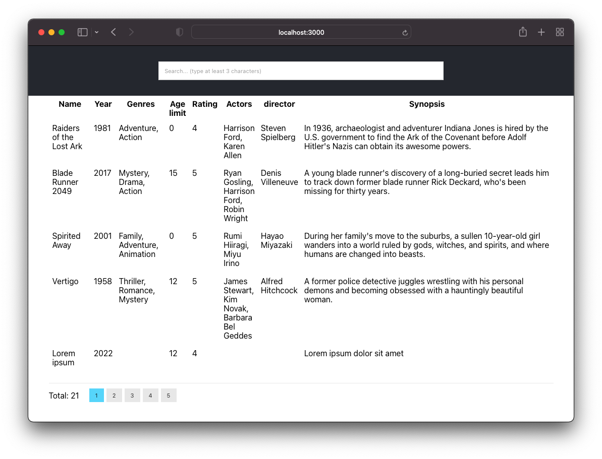

# Summary
- The application consists of a backend and frontend, which are both hosted in this mono-repo
- Backend uses docker-compose
- Frontend is served by a dev server started by `react-scripts`

